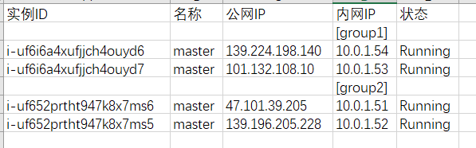
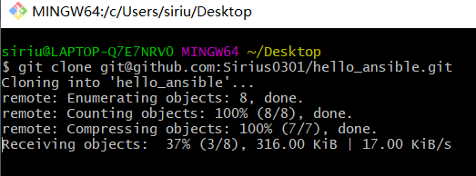
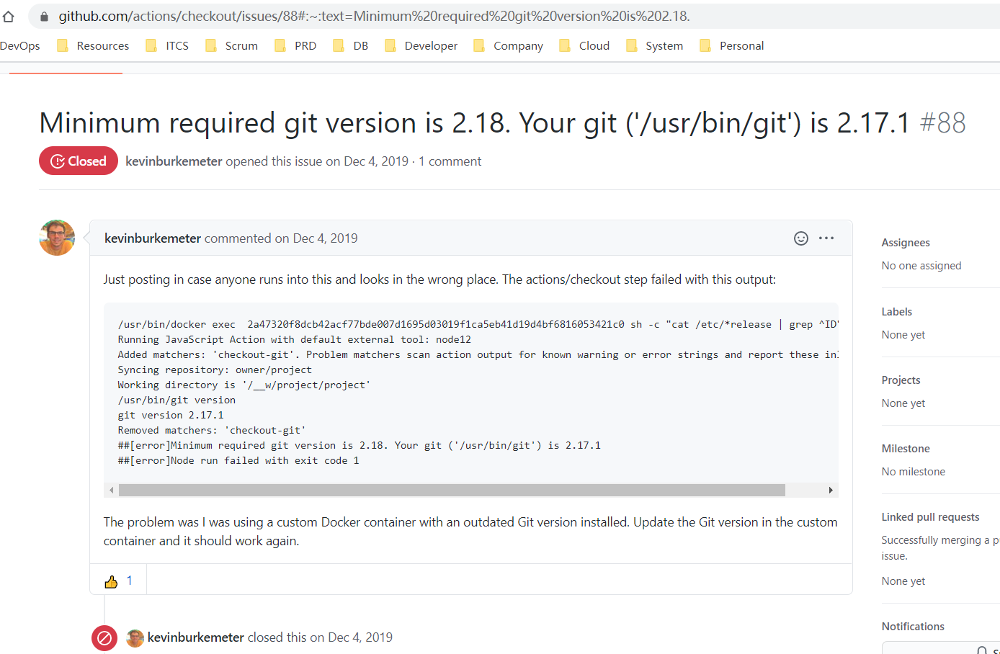
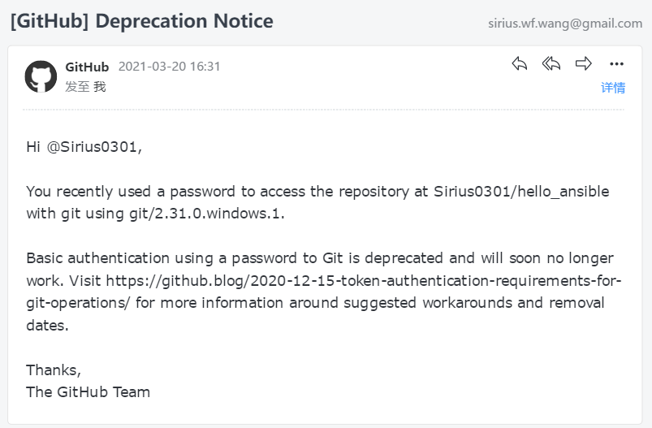
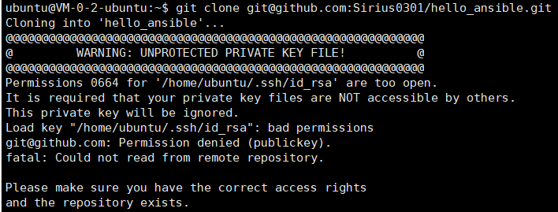
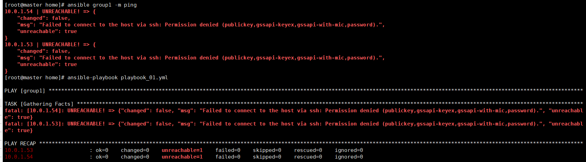
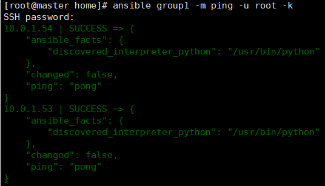

# Hello Ansible Live Gideline

## 1. Environment Settings

### 1.1 Create VM for everyone

- Get the numbers of participants who need to practise ansible. create the ECS in [aliyun cloud](https://signin.aliyun.com/1361822225052290.onaliyun.com/login.htm)

- Get the Public IP and Private IP.  Assign them to Participants. Export the result to excel.

- Group the private ip. for example: 

  

### 1.2 Clone github repository

- Introduce the github repository. use the Zip as backup. In case participants can not clone it. 

- `git clone git@github.com:Sirius0301/hello_ansible.git`

> Notice
>
> - Minimum required git version is 2.18. please run git --version to check 
>
>   
>
> - Basic authentication using a password to Git is deprecated and will soon no longer work. 
>
>   - using ssh-keygen to add ssh key into your github account
>
>     for example: ssh-keygen -t rsa -b 4096 -C "sirius.wf.wang@gmail.com" 
>
> 
>
> - if there is error like below, please change the privilege code of your ssh private key file.
>
>   - in linux or mac you can run `sudo chmod 600 .ssh/id_rsa`
>
> 
>
>   you can get more about github ssh information [github docs - about ssh](https://docs.github.com/en/github/authenticating-to-github/about-ssh)

## 2.  Introduce Ansible by using the PPT as guideline

### 2.1  环境准备 
参与者应提前准备 xshell or putty

### 2.2  Ansible 应用场景
见 ppt [5,8] 页
  - 开发场景 -- Shimin

  - 运维场景 -- Shimin

  - Citi 应用场景 -- Toby

### 2.3 发展历史
见 ppt  9页
  - 发展历史

## 3. Ansible 讲解

### 3.1 安装 ansible 
    - 手动安装ansible到个人使用主机, 使用脚本 initial_ansible.sh
    
      `cd hello_ansible/`
    
      `chmod +x shell/initial_ansible.sh`
    
      `yes Yes| shell/initial_ansible.sh`
    
      >  顺便介绍 Linux 权限code与 修改权限code 命令
    
  
      

      `chmod +x initial_ansible.sh`  <=> `chmod 700 initial_ansible.sh`

### 3.2 尝试运行ansible

    - 执行如下ansible 命令和 ansible-playbook 命令，会出现错误
    
      `ansible group1 -m ping`
    
      `ansible-playbook playbook_01.yml`
    

  
    
    - 因为 ansible是基于ssh, 所以必须要和ssh一样，远程连接，指定用户，并输入密码
    
      `ansible group1 -m ping -u root -k`
    
      input your password, then you will see: 
    

  

### 3.3 ssh 配置免密登录
> 生成 公钥密钥
`ssh-keygen -t dsa`
> 拷贝公钥到node节点
`ssh-copy-id -i /root/.ssh/id_dsa.pub root@10.0.1.54`
> 验证 node 是否已添加
`ssh root@10.0.1.54`
`ll /root/.ssh/authorized_keys`

批量复制 id_dsp.pub 到node 节点

shell/copy_ssh_pub_to_all_hosts.sh

### 3.4  ansible 配置文件介绍 

`vim /etc/ansible/ansible.cfg`

打开log 日志

`tail -20 /var/log/ansible.log`

> vim 设置行号可见
> :set nu
### 3.5 ansible 主机清单

#### 3.5.1 主机清单

> 手动编辑 /etc/ansible/hosts里面的内容
> vim /etc/ansible/hosts

`ansible all --list-hosts`

#### 3.5.2 ansible 的 主机清单匹配模式

- All : 表示所有Inventory 主机

  `ansible all -m ping`

- * : 通配符

  `ansible "*" -m ping`
  `ansible 192.168.1.* -m ping`
  `ansible "*srvs" -m ping`

- 逻辑或

  `ansible "websrvs:appsrvs" -m ping`
  `ansbile "192.168.1.10:192.165.1.20" -m ping`

- 逻辑与

  > 在websrvs组 并且在 dbsrvs 组中的主机
  > `ansible "websrvs:&dbsrvs"  -m ping`

- 逻辑非

- 正则表达式
  `ansible "~(web | db)srvs" -m ping`
  `ansible "~(web | db).*\.magedu\.com" -m ping`

- ansible-galaxy

  > 下载优秀的roles模板 [ansible-galaxy](galaxy.ansible.com)
  > `ansible-galaxy list`

### 3.5 ansible 特性

#### 3.5.1 基于ssh, 也因此是 serveless的服务
见ppt 10页
- 利用ssh 远程执行 shell脚本

  `scp -p22 -r -p hello_ansible/shell/initial_ansible.sh root@10.0.1.54:/home/`

  `ssh root@10.0.1.54`

  `chmod +x /home/initial_ansible.sh`

  `/home/initial_ansible.sh`

- 利用ansible-playbook 执行一样的操作

  `ansible-playbook playbook_02.yml ` 

#### 3.5.2 ansible 幂等性

多次执行

`ansible-playbook playbook_02.yml ` 

结果一致

## 4 ansible-playbook

### 4.1 查看帮助命令

`ansible-playbook --help`

### 4.2 检查 playbook.yml 语法

`ansible-playbook -C playbook_01.yml`

### 4.3 ansible-playbook 基础

**ansible module**

#### 4.3.1 查看ansible 目前总的 module 数量

`ansible-doc -l | wc -l`

### 4.3.2 常用module 总结

- copy
- scp
- command
- script
- template
- user
- git
- corn
- file
- group
- service
- yum
- ....

> 根据实际应用与生产需要，逐个模块使用学习和熟悉

## 5. ansible roles

